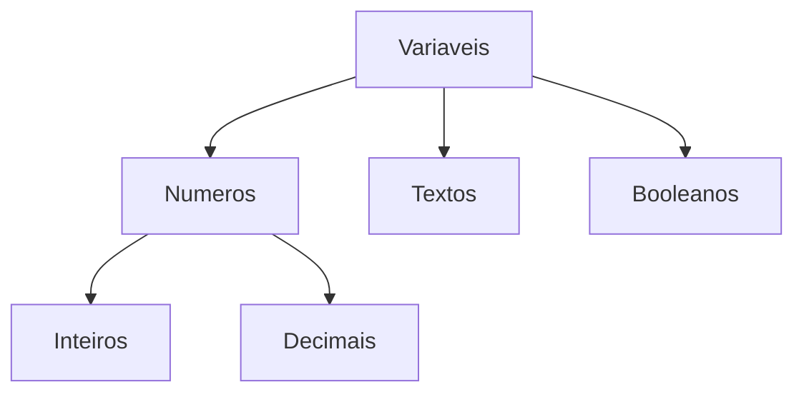

# aula03-dsii

 ##teste de ediçao

# Aula01 Variáveis

**Nome:** [Coloque seu nome aqui]  
**Matéria:** [Coloque a matéria aqui]  
**Data:** [Coloque a data aqui]  

---

## O que é um arquivo Markdown (.md)?
Markdown é uma linguagem de marcação muito simples, projetada para formatar textos na web e em documentações de projetos de forma rápida, usando caracteres comuns do teclado.

---

## 🛠️ Manual Básico de Formatação

### 1. Títulos (Cabeçalhos)
Use o símbolo de cerquilha (`#`) para criar títulos. Quanto mais símbolos, menor será o título.

```markdown
# Título Principal (H1)
## Subtítulo (H2)
### Título Menor (H3)
```

### 2. Estilos de Texto
Você pode destacar palavras facilmente:

* **Negrito:** Envolva o texto com dois asteriscos `**texto**` ➡️ **texto**
* *Itálico:* Envolva o texto com um asterisco `*texto*` ➡️ *texto*
* ~~Tachado:~~ Envolva com dois tils `~~texto~~` ➡️ ~~texto~~
* `Código inline`: Envolva com crases ➡️ `print("Olá!")`

### 3. Listas
**Listas de Marcadores (Não ordenadas):**
Use hifens `-` ou asteriscos `*`.
* Item 1
* Item 2
  * Sub-item (adicione espaços antes)

**Listas Numeradas (Ordenadas):**
Basta usar números seguidos de ponto.
1. Primeiro passo
2. Segundo passo
3. Terceiro passo

### 4. Blocos de Código
Para inserir códigos de várias linhas, use três crases (```) antes e depois. Você também pode especificar a linguagem de programação.

```python
# Exemplo de variáveis em Python
nome_aluno = "Lucas"
idade = 21
print(f"Olá, {nome_aluno}!")
```

### 5. Links
Use colchetes para o texto e parênteses para a URL:
`[Google](https://google.com)` ➡️ [Google](https://google.com)

---

## 🖼️ Exemplo de GIF
Para adicionar imagens e GIFs, o formato é muito parecido com o dos links, mas começa com um ponto de exclamação `!`.

``

**Resultado:**


---

## 🎨 Exemplos de Desenho

Você pode fazer "desenhos" em Markdown de duas formas principais:

### 1. ASCII Art (Arte com Texto)
Basta colocar a arte dentro de um bloco de código (com três crases) para que a formatação não quebre.

```text
 /\_/\
( o.o )
 > ^ <
```

### 2. Diagramas com Mermaid
Muitos visualizadores de Markdown (como GitHub, GitLab e Notion) suportam **Mermaid**, que permite desenhar fluxogramas através de código. 



---
*Fim do documento. Sinta-se livre para editar os placeholders lá em cima e apagar este manual depois que aprender os comandos!*